# Secure Container Supply Chain — Demo

A working **secure container supply chain** demo for Azure Container Registry (ACR) and AKS.

It shows two Azure DevOps pipelines with **two complementary gate models**, both powered by **Microsoft Defender** (deliberately *not* Trivy):

| Pipeline | File | What it shows |
|---|---|---|
| **Build & push our own image** | `pipelines/azure-pipelines-build.yml` | `docker build` → **Defender for Cloud CLI** scan **before push** (`break=true`) → push only on pass → **sign**. True shift-left: a failing image never enters the registry. |
| **Ingest a third-party image** | `pipelines/azure-pipelines-ingest.yml` | `az acr import` into a **separate quarantine ACR** → **Defender** registry gate → **Copacetic** patch → re-gate → promote to a **golden** repo in the trusted ACR → **sign**. |

> **Why two models?** Our own code can be **scanned before it is ever pushed** (Defender for Cloud CLI, GA Nov 2025). A third-party image we can't rebuild has to land *somewhere* to be scanned — so it goes into a dedicated **quarantine registry** nothing deploys from, and is only promoted to the trusted ACR once it passes.

> **Why this matters:** a common ask is for ACR *quarantine*. Quarantine has been in preview 6+ years. This demo achieves the same intent — *only trusted, scanned, patched, signed images reach AKS* — using supported services, and enforces it at the gate that matters (the cluster).

## The control flow

```mermaid
flowchart TD
    subgraph BUILD["BUILD (our code)"]
        B1["docker build (local)"] --> B2["Defender for Cloud CLI scan<br/>(break=true)"]
        B2 -->|fail| B3["STOP (never pushed)"]
        B2 -->|pass| B4["push → trusted ACR"]
        B4 --> B5["Notation sign"]
        B5 --> B6["AKS"]
    end

    subgraph INGEST["INGEST (3rd-party image)"]
        I1["az acr import →<br/>QUARANTINE ACR<br/>(no AKS access)"] --> I2["Microsoft Defender for Containers<br/>(THE GATE)"]
        I2 -->|findings &gt; Medium| I3["Copacetic (copa)<br/>patch OS CVEs, no rebuild<br/><i>Trivy feeds Copa here only, not the gate</i>"]
        I3 -->|re-scan w/ Defender| I4["promote → golden repo (trusted ACR)"]
        I4 --> I5["Notation sign"]
        I5 --> I6["AKS admission<br/>(Ratify + Azure Policy Deny)"]
    end
```

## Components

- **`app/`** — a trivial Python API + `Dockerfile` pinned to an older base on purpose, so Defender finds real OS CVEs and Copa has something to patch.
- **`scripts/defender-gate.sh`** — the headline control. Reads **Microsoft Defender for Containers** findings for the pushed image (via Azure Resource Graph) and fails the build on anything above a configurable severity.
- **`scripts/copa-patch.sh`** — Copacetic OS-package patching (no rebuild). Trivy is used *only* to produce Copa's input report.
- **`scripts/sign-image.sh`** — Notation signing with AKV or Artifact Signing (formerly Trusted Signing).
- **`infra/create-acr.sh`** — reproducible ACR + Defender + Continuous Patching setup.
- **`docs/DEMO-WALKTHROUGH.md`** — run order and talking points for the call.

## Prerequisites

- A **Premium ACR** (`infra/create-acr.sh`).
- **Microsoft Defender for Containers** enabled on the subscription (already on for the demo sub).
- An ADO **ARM service connection** with `AcrPush` + reader on the registry and the subscription (for the Resource Graph query). Set its name in each pipeline's `azureSubscription` variable.
- For signing: an AKV-held cert (or an Artifact Signing account) and its key id in `signingKeyId`.

## Deploy-time enforcement (the other half)

Signing is only useful if something checks it. On AKS, install **Ratify + Azure Policy (Deny effect)** so unsigned/untrusted images are refused admission. See `docs/DEMO-WALKTHROUGH.md`.

---
*A generic demonstration of secure container supply chain controls. All registry, subscription, and resource names are placeholders — replace them with your own.*
