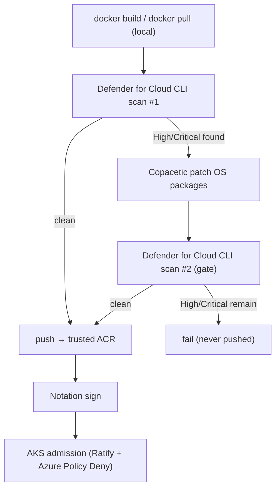

# Secure Container Supply Chain — Demo

A secure container supply chain demo for Azure Container Registry (ACR) and AKS.

It contains two Azure DevOps pipelines. Both build or pull an image, scan it inline with the **Microsoft Defender for Cloud CLI** before it is pushed, patch with **Copacetic** if needed, re-scan, push a passing image to the trusted registry, then sign it.

| Pipeline | File | What it does |
|---|---|---|
| **Build our own image** | `pipelines/azure-pipelines-build.yml` | `docker build` → Defender CLI scan → Copa patch (if High/Critical) → re-scan gate → push on pass → sign. |
| **Ingest a third-party image** | `pipelines/azure-pipelines-ingest.yml` | `docker pull` upstream → Defender CLI scan → Copa patch (if High/Critical) → re-scan gate → push on pass → sign. |

Both pipelines pull or build the image onto the agent and scan it locally with the Defender CLI. Nothing is pushed to a registry until the scan gate passes.

## The control flow

## Components

- **`app/`** — a Python API and `Dockerfile` pinned to an older base, so Defender finds OS CVEs and Copa has packages to patch.
- **`scripts/copa-patch.sh`** — Copacetic OS-package patching. Trivy produces Copa's input report.
- **`scripts/sign-image.sh`** — Notation signing with AKV or Artifact Signing.
- **`infra/create-acr.sh`** — ACR + Defender + Continuous Patching setup.
- **`docs/DEMO-WALKTHROUGH.md`** — run order for the demo.

## Prerequisites

- A **Premium ACR** (`infra/create-acr.sh`).
- **Defender CSPM** enabled on the subscription.
- An ADO **ARM service connection** with `AcrPush` on the registry. Set its name in each pipeline's `azureSubscription` variable.
- Defender CLI authentication: an Azure DevOps connector in Defender for Cloud, or token-based auth via `DEFENDER_*` pipeline secrets. See `docs/DEFENDER-PREVIEW-SETUP.md`.
- For signing: an AKV-held cert (or an Artifact Signing account) and its key id in `signingKeyId`.

## Deploy-time enforcement

On AKS, install **Ratify + Azure Policy (Deny effect)** so unsigned images are refused admission. See `docs/DEMO-WALKTHROUGH.md`.

---
*A generic demonstration of secure container supply chain controls. All registry, subscription, and resource names are placeholders — replace them with your own.*
